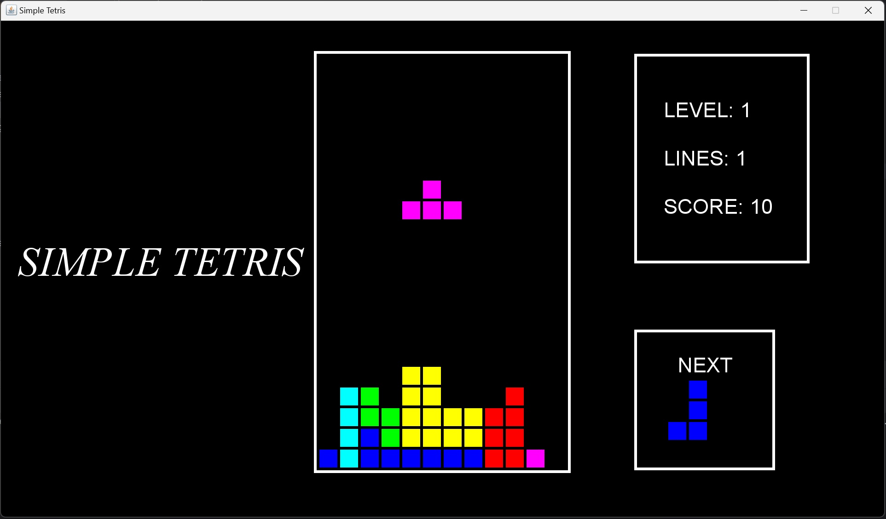

# Tetris
A Tetris game using Java and Swing.   

## How to play
1. Fork this repository into your own account.
2. Clone the repository to your local machine.
3. Run the `main.java` in the `main` package.
4. Enjoy the game!

## Features
- Different levels of difficulty (By removing 10 lines, the level goes up and the speed of Minos increases)
- Sound effects
- Collisions
- Pause and resume (using `Space` key)
